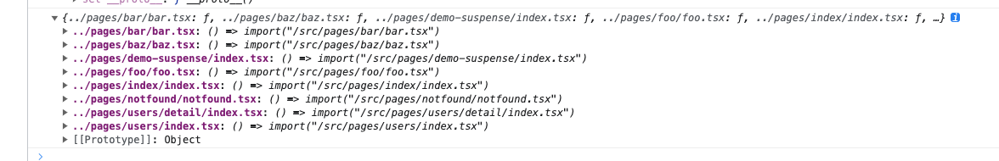
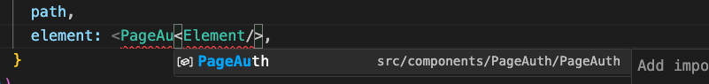

# demo-react

## 如何使用lazy+suspense实现路由懒加载

```tsx
const DemoSuspense = lazy(() => import('../pages/demo-suspense').then((res) => {
  return {
    default: () => res.DemoSuspense(),
  }
}))
```

```tsx
// router
const router = createBrowserRouter([
  {
    index: true,
    path: '/',
    element: <IndexPage/>,
  },
  {
    index: true,
    path: '/suspense',
    element: <Suspense fallback={<Loading/>}>
      <DemoSuspense/>
    </Suspense>,
  },
  {
    path: '*',
    element: <NotFond/>,
  },
], {
  basename: '/app',
})
```

## lazy 懒加载原理
## suspense 原理
## react-router-dom 原理
### RouterProvider 是什么

## 使用glob动态加载路由 

引入 `vite/client` 支持vite特有的属性；

1. 通过三斜线方式引入

```ts
/// <reference types="vite/client" />
```

注意 因为tsconfig.json 配置了include: ["./src"];
所以需要将 `vite-env.d.ts` 放入到src目录下,或者将 `vite-env.d.ts` 加入到include中

2. 通过添加types引入

```json
// tsconfig.json
{
  "types": [
    "vite/client"
  ]
}
```



## 配置项目别名



```json
// tsconfig.json
{
  "paths": {
    "@/*": ["src/*"]
  }
}
```

## 添加env变量

在项目跟目录下添加env变量

```env
# .env
VITE_APP_NAME=demo-react
```

添加ts支持

```ts
/// <reference types="vite/client" />

interface ImportMetaEnv {
  readonly VITE_APP_NAME: string
}

interface ImportMeta {
  readonly env: ImportMetaEnv
}
```